# Diary

## 2026-03-06

```
快乐不多，今日买了一张5060ti
```

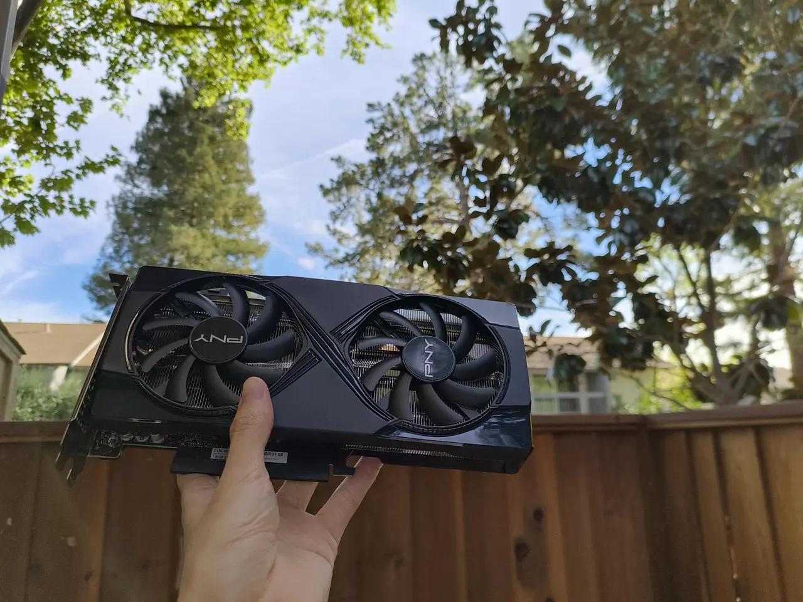

## 2026-03-16

```
预训练实验: 用gpt-2复现了scaling_law，loss仿佛撞上无形的墙
```

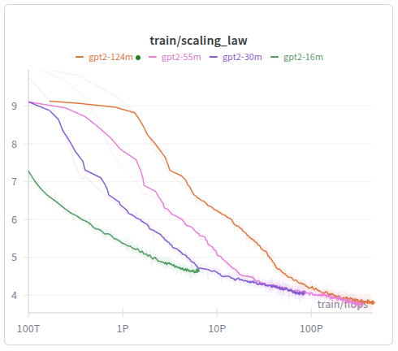


## 2026-04-03

```
公司搬办公室，有一台闲置主机，同事一人拿走一张1080显卡留作纪念，剩下的让我带回家
正好我的好朋友fc有一张闲置5090能租给我，我们商量了扣除电费之后$0.2一小时
今天我是富哥
```

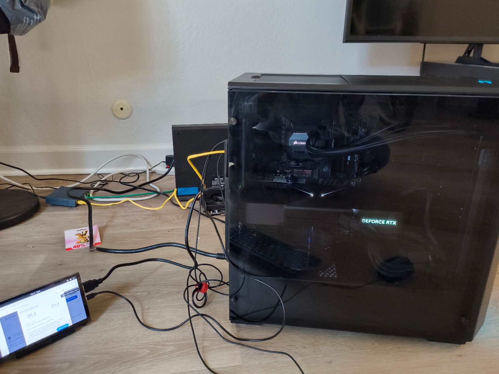

## 2026-04-04

```
今天在写 pretrain，一些还挺意外的发现，一个是对于小模型（<1B），torch.compile之后的性能很好，不怎么需要再写kernel，openai的[parameter golf](https://github.com/openai/parameter-golf)也是这样，我尝试了很多次用kernel优化速度，结果发现还不如torch.compile

另一个是pretrain 用 torch.compile autotune kernel + 预先处理 tokenize 之后，其实对 cpu 要求不高，我用10年前的E5-2690v3也能顺利跑，吃不到 cpu 瓶颈。硬盘是随便凑的 HDD，本来以为会碰I/O瓶颈，但实测情况也远远好于预期，5060 ti完全没问题，5090一开始会跑到有点吃不消，跑过一段时间data page都被刷进内存之后，速度也没问题了，可以跑满。

所以，我就拿十年前的硬件搭配最新的显卡，竟然跑起了pretrain！
```

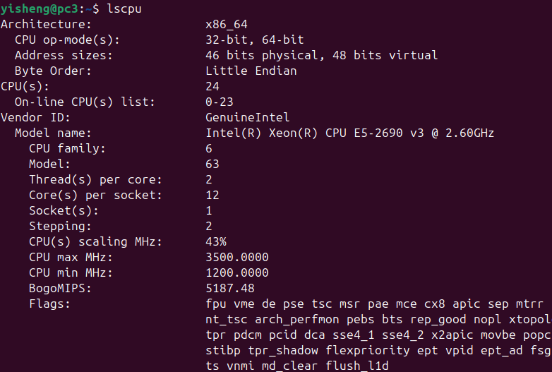

## 2026-04-25

```
debug this for several days, finally find out it's a cuda stream + torch.compile bug, only have wait_stream but omit record_stream in code, see this: https://github.com/gongyisheng/pretrain/blob/main/docs/torch_compile_prefetch_bug/README.md
```

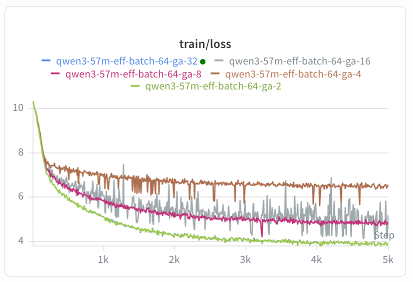

## 2026-05-12

```
记，买了一张 rtx 6000 pro
```

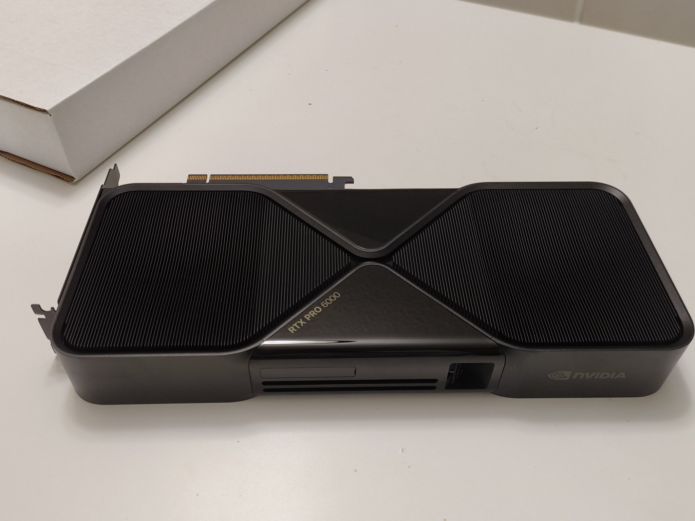

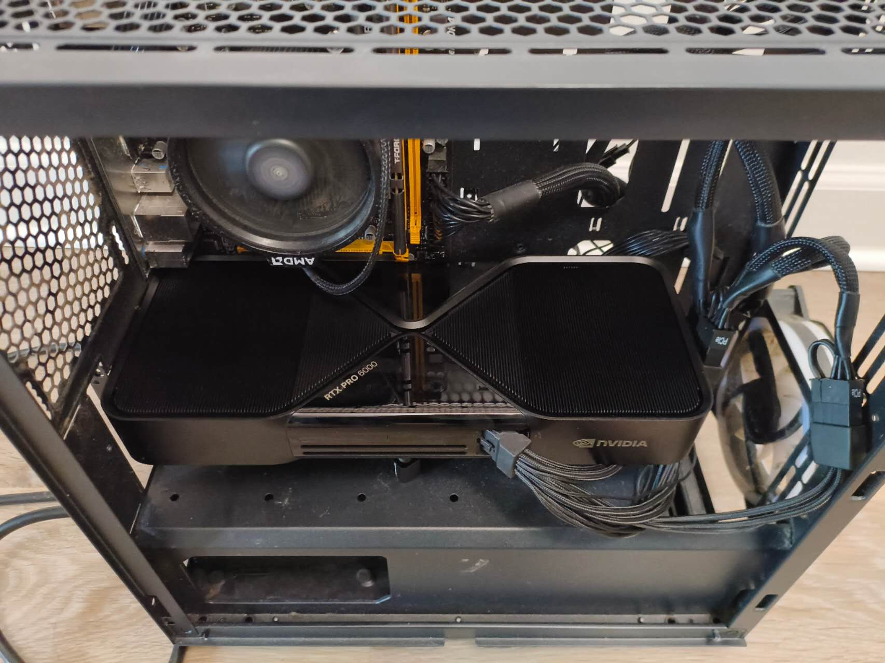

## 2026-05-18

```
finally reproducing superbpe (2503.13423), after writting a cpp extension and do rounds of perf/memory optimization.
```

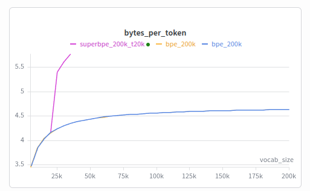

## 2026-05-22

```
grokking reproduced
```

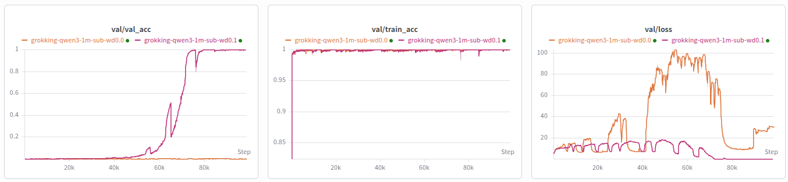

## 2026-05-30

```
记: 已经用了两周，基本是24X7跑满，上周做了seq_len的ablation，这周会做fp8。在实验间隙跑了跑RL测试，已经能顺利跑起来了，十分开心
```

## 2026-06-04

```
记: 第三周，今天跑起了多机RL，在给miles/sglang加distributed lora training的feature，这张卡当train engine, 另一边2X5060Ti当rollout engine，家用交换机互联，已经跑起来了，十分开心

pr: https://github.com/sgl-project/sglang/pull/27268
```

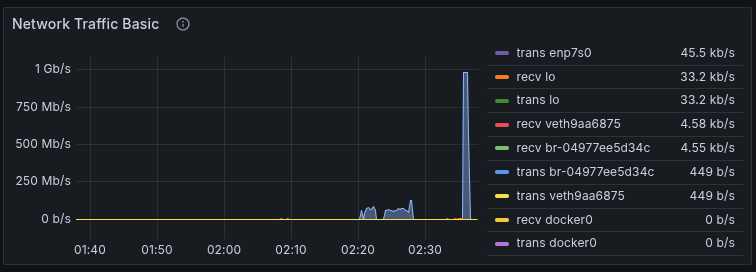

## 2026-06-10

```
记: 一个月，这周在学习muon和数学。卡多体验也好起来了，每天都大概能看到一些实验进展，也大概知道了之前入门ML失败的原因是没有买卡
```

## 2026-06-11
```
记: 今天 34 度，停电。中午茫然四顾，无事可做。上个月电费来到720度，与室友商量，其中250度平分，剩下的我出
```


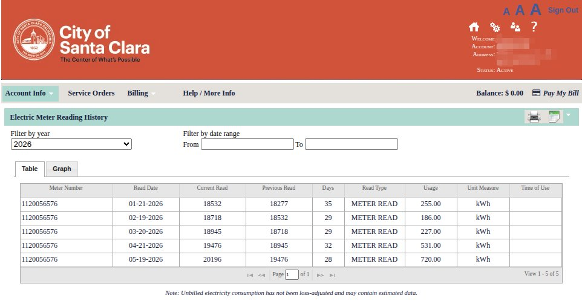